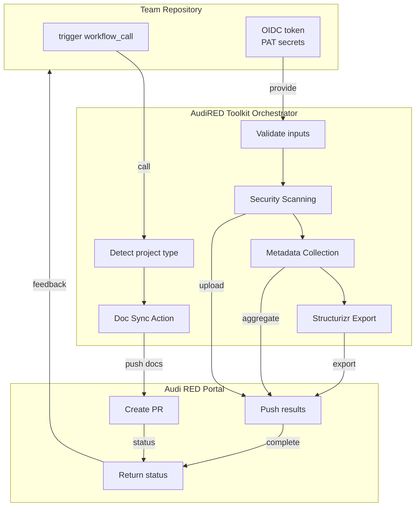

# AudiRED Toolkit

Centralized orchestration platform for automating documentation sync, security scanning, and metadata collection across Audi RED repositories.

## 📋 Table of Contents

- [Overview](#overview)
- [Key Features](#key-features)
- [Architecture](#architecture)
- [Quick Start](#quick-start)
- [Configuration](#configuration)
- [API Reference](#api-reference)
- [Security](#security)
- [Troubleshooting](#troubleshooting)
- [Documentation](#documentation)
- [Contributing](#contributing)
- [License](#license)

## Overview

The **AudiRED Toolkit** is a centralized GitHub Actions workflow orchestrator that automates critical DevOps and documentation tasks for the Audi RED platform. It enables team repositories to seamlessly sync their architecture documentation, metadata, and security scan results to the central [Audi RED Documentation Portal](https://red-docs.audired.ca).

### Key Capabilities

- **Documentation Synchronization**: Automatically publish and update ARB (Architecturally Significant Review) documentation to the portal
- **Security Scanning**: Run security vulnerability and license compliance checks on every build
- **Architecture Diagrams**: Generate and export C4 architecture diagrams from Structurizr DSL
- **Metadata Collection**: Gather repository metadata, dependency information, and test coverage metrics
- **Multi-Destination Publishing**: Sync to RED Documentation Portal, Confluence Cloud (MSI & VWGOA), and more
- **Configuration-Driven Routing**: App-type profiles automatically route content to correct portal sections
- **Idempotent Operations**: Safe to re-run; prevents duplicate PRs and duplicate scans

## Key Features

✅ **Centralized Workflow Management** - Single reusable workflow (`audired-toolkit.yml`) called by consuming repositories  
✅ **Multi-App-Type Support** - Handle feature apps, backend services, mobile apps, and special tools with unified interface  
✅ **OIDC-Based Authentication** - GitHub Actions workload identity federation; no long-lived credentials  
✅ **Automated Documentation Sync** - Push ARB docs to portal PRs for review and merge  
✅ **Security Intelligence** - Integrate SCANOSS for CVE tracking and license compliance  
✅ **Architecture Visualization** - Generate C4 diagrams from Structurizr DSL  
✅ **Retry & Error Handling** - Built-in resilience for transient failures  
✅ **Audit Trail** - Git-backed history; full traceability of changes

## Architecture

The toolkit follows a distributed architecture with a central orchestrator:

For detailed architecture, see [Architecture Documentation](docs/architecture.md) and [ARB Documentation](docs/arb/).

## Quick Start

To integrate the AudiRED Toolkit into your repository:

1. **Set up your CI/CD workflow** - Ensure your repository has a working continuous integration pipeline
2. **Configure secrets** - Add `DOC_SYNC_KEY` to your repository secrets (contact Platform Team)
3. **Call the toolkit workflow** - Use the reusable workflow in your `.github/workflows/`
4. **Structure your ARB documentation** - Follow the standard ARB folder structure

For detailed setup instructions with code examples and configuration steps, see the [Toolkit Setup Guide](docs/toolkit-setup-guide.md).

## Configuration

The toolkit is configured via workflow inputs and app-type profiles:

- **App-Type Profiles** - Automatically routes documentation to correct portal sections based on app type
- **Workflow Inputs** - Control sync behavior, deployment targets, and custom paths
- **Multi-Destination Support** - Publishes to RED Portal, MSI Confluence, and VWGOA

For complete configuration details, supported app types, and workflow inputs reference, see the [Configuration Guide](docs/toolkit-setup-guide.md#configuration).

## API Reference

The toolkit exposes a single reusable workflow:

**Workflow:** `RED-Internal-Development/audi-red-toolkit/.github/workflows/audired-tookit.yml`

**Inputs:** App type, sync flags, user/actor details, custom paths  
**Outputs:** Documentation PRs, security reports, metadata, architecture diagrams

For complete API documentation including all parameters, call signatures, and examples, see the [API Reference](docs/toolkit-setup-guide.md#api-reference) in the setup guide.

## Security

Key security practices:

- **OIDC Federation**: GitHub Actions uses workload identity; no long-lived GitHub tokens
- **Deploy Key Scoping**: SSH key scoped to destination repository and team branch only
- **Secrets Encryption**: All secrets encrypted at rest by GitHub (AES-256)
- **Idempotency**: Re-runs are safe; prevent duplicate PRs and scans
- **Audit Trail**: Full Git history in `audi-red-documentation`
- **Branch Protection**: PRs require review before merge

For detailed security posture, see [Security Handling Documentation](docs/arb/security/security_handling.mdx).

## Documentation

- **[Architecture Documentation](docs/architecture.md)** - System design and data flow
- **[ARB Documentation](docs/arb/)** - Architecturally significant review (security, interfaces, decisions)
- **[Toolkit Setup Guide](docs/toolkit-setup-guide.md)** - Step-by-step integration guide
- **[API Documentation](docs/arb/service_apis/)** - Workflow inputs/outputs reference
- **[Security Handling](docs/arb/security/security_handling.mdx)** - Authentication, authorization, threat model

## Contributing

Contributions are welcome! To contribute:

1. Fork the repository
2. Create a feature branch: `git checkout -b feature/your-feature`
3. Make changes and test locally
4. Commit with clear messages
5. Push and create a Pull Request
6. Platform Team reviews and merges

For major changes, please open an issue first to discuss.

## License

This project is licensed under the MIT License - see the [LICENSE](LICENSE) file for details.

---

## Support

- **Documentation Portal**: https://red-docs.audired.ca
- **Audi RED Team**: Platform Engineering Team
- **Issues**: Create an issue in this repository
- **Slack**: #audi-red-platform (internal)
