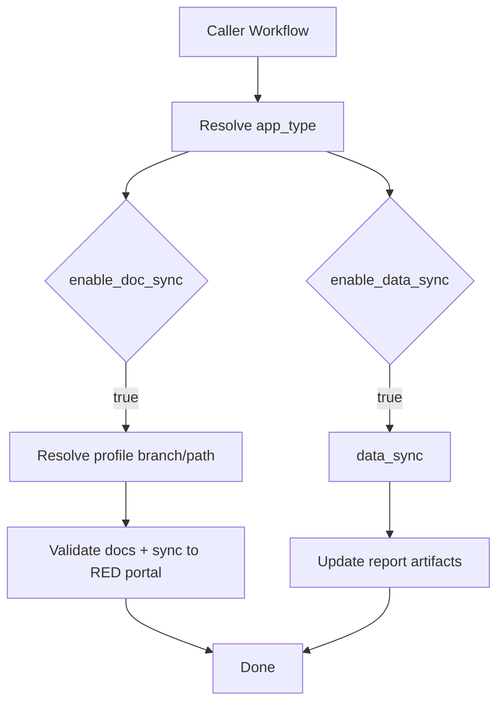

# AudiRED Toolkit Setup & Usage Guide

## Introduction

The AudiRED Toolkit is a reusable GitHub workflow that utilizes many of the existing services AudiRED has to offer, all under one evolving workflow. The AudiRED Data Collection Action is a GitHub action that assists in providing reporting metrics across all teams.

The toolkit supports **feature apps**, **backend services**, **mobile apps**, and **special apps**, with automatic project type detection based on your test framework configuration.

## The setup is intended for repositories that are running a continuous integration workflow prior to running the toolkit.

## Purpose

Use this reusable workflow to:

- Sync docs to the RED Documentation Portal
- Optionally collect/report metadata (`enable_data_sync`)
- Optionally enable VWGOA deployment (only for supported app types)

MSI and VWGOA behavior is profile-driven by `app_type`.

## Workflow Location

- Workflow: `.github/workflows/audired-tookit.yml`
- Profile config: `config/app-type-profiles.yml`

---

## Setup

### (1) Enable jest coverage reports for the AudiRED CollectionKit action

**Note**: This step is required for both frontend apps (unit tests) and backend services (primary test coverage).

In your `package.json`, add the following script under `scripts`:

```json
"test:coverage": "jest --coverage --coverageReporters='json-summary'"
```

Inside your `.github/workflows/cicd.yml`, update the "Unit test" step under the `ci` job:

```yaml
- name: Unit test
  run: npm run test:coverage
```

### (2) Enable cypress test code coverage instrumentation for the AudiRED CollectionKit action

**Note**: This step is only required for **frontend apps** with E2E testing. Backend services can skip this section.

**Please note**: Upgrade to the latest bilbo versions (11.0.0+) and enable the `swc` compiler.

---

Add all the dev dependencies to your project:

```
npm install --save-dev @cypress/code-coverage nyc
```

---

In your `./cypress.config.ts` (or `.js`) file, edit `setupNodeEvents`:

```ts
// Before
setupNodeEvents(on, config) {
    return require('./tests/cypress/plugins')(on, config);
},

// After
setupNodeEvents(on, config) {
    require('./tests/cypress/plugins')(on, config);
    require('@cypress/code-coverage/task')(on, config);
    return config;
},
```

---

In `./tests/cypress/support/e2e.ts`, import the coverage support:

```ts
import "./commands";
import "@cypress/code-coverage/support";
```

---

In your `package.json`:

1. Add the following script:

```json
"test:e2e-run-dev": "start-server-and-test serve http-get://localhost:3000 'cypress run'"
```

2. Add this `nyc` configuration to avoid conflicts between jest and cypress coverage (both use istanbul under the hood):

```json
"nyc": {
  "report-dir": "cypress-coverage",
  "reporter": ["text", "json"]
}
```

Verify instrumentation by running `npm run test:e2e-run-dev`. A non-empty `.nyc_output` folder with JSON data should be created on completion.

### (3) Add the AudiRED CollectionKit action to your `.github/workflows/cicd.yml`

Under the `ci` job, add the following as your last step:

**For frontend apps:**

```yaml
- name: AudiRed Collection Kit
  uses: RED-Internal-Development/audi-red-collection-kit@main
  with:
    github_token: ${{ secrets.GITHUB_TOKEN }}
    jest_coverage_file_path: coverage/coverage-summary.json
    lighthouse_coverage_file_path: .lighthouseci/assertion-results.json
```

**For backend services** (omit `lighthouse_coverage_file_path` if not applicable):

```yaml
- name: AudiRed Collection Kit
  uses: RED-Internal-Development/audi-red-collection-kit@main
  with:
    github_token: ${{ secrets.GITHUB_TOKEN }}
    jest_coverage_file_path: coverage/coverage-summary.json
```

> **Tip**: Search for the `generate-release` job and add this step before it, ensuring you are under the `ci` job. Adding it last ensures that unit tests, E2E tests, and lighthouse steps complete before the collection action runs.

Your `cicd.yml` should look something like this:

```yaml
name: "Continuous integration / Continuous delivery"

on:
  push:
    branches: ["**"]
  release:
    types: [published]
  workflow_dispatch:

jobs:
  ci:
    name: "Continuous Integration"
    runs-on: ubuntu-latest
    steps:
      - name: Checkout
        uses: actions/checkout@v4.2.2
      # ...
      - name: Unit test
        run: npm run test:coverage
      # ...
      - name: AudiRed Collection Kit
        uses: RED-Internal-Development/audi-red-collection-kit@main
        with:
          github_token: ${{ secrets.GITHUB_TOKEN }}
          jest_coverage_file_path: coverage/coverage-summary.json
          lighthouse_coverage_file_path: .lighthouseci/assertion-results.json
```

### (4) Add the AudiRED Toolkit reusable workflow

Prefer to manually add the workflow, copy the appropriate YAML from the [examples below](#examples) into your repository's `.github/workflows/` folder.

> **Note**: `workflow_run` only triggers after being merged into your default branch. This is a known GitHub limitation.

---

## Supported App Types

Use the `app_type` input (preferred):

| Value             | Description                                  |
| ----------------- | -------------------------------------------- |
| `feature_app`     | Frontend / feature app                       |
| `backend_service` | Backend service                              |
| `mobile_app`      | Mobile application                           |
| `special_app`     | Special app (custom path override supported) |

**Legacy support**: `project_type` is deprecated but still accepted and mapped automatically:

| Legacy value      | Maps to             |
| ----------------- | ------------------- |
| `frontend-app`    | `feature_app`       |
| `backend-service` | `backend_service`   |
| `mobile-app`      | `mobile_app`        |
| `special-app`     | `special_app`       |
| `auto-detect`     | deprecated fallback |

If `app_type` does not map to a known profile key, the workflow fails fast.

**Precedence**: `app_type` is always used when provided. `project_type` is only used when `app_type` is not set.

---

## Branch and Path Resolution

Branch and destination path are selected from `config/app-type-profiles.yml` based on the resolved `app_type`. `destination_branch` is deprecated and ignored by runtime logic.

- RED docs branch: `red_docs.branch`
- RED docs base path: `red_docs.base_path`
- App folder resolved by replacing `{app}` with repository app name

---

## Special App Rules

> **Note:** Using the toolkit as a `special_app` is a specific use case intended for non-standard documentation paths. **Please contact the RED team before onboarding your repository as a Special App to ensure the correct path and configuration are set up for your team.**

For `app_type: special_app`:

- RED docs sync is supported
- MSI config is not used
- VWGOA is disabled (workflow fails if requested)
- Default branch: `docs-sync/special-apps`

Use `red_docs_portal_path_override` to specify a custom destination path. Guardrails apply:

- Must start with `docs/`
- Must not contain `..`
- If `{app}` is missing, `/<app_name>` is appended automatically

---

## Independent Job Behavior

`data_sync` and `doc_sync` run independently:

- `enable_data_sync: true` runs the data sync job
- `enable_doc_sync: true` runs the doc sync job
- Both can run together or independently

---

## Examples

### Feature App

```yaml title="audired-toolkit.yml"
name: Audi RED Toolkit
on:
  schedule:
    - cron: "0 0 * * *" # ~9pm ET
  workflow_run:
    workflows: ["Continuous integration / Continuous delivery"]
    branches:
      - main
    types:
      - completed

jobs:
  audired-toolkit:
    uses: RED-Internal-Development/audi-red-toolkit/.github/workflows/audired-tookit.yml@main
    with:
      source_file: "docs/APP_NAME"
      app_type: "feature_app"
      enable_doc_sync: true
      enable_data_sync: true
      enable_vwgoa_prod_support_deployment: false
      user_email: "redsys1@audired.ca"
      user_name: "audired"
      user_actor: ${{ github.actor }}
    secrets:
      DOC_SYNC_KEY: ${{ secrets.DOC_SYNC_KEY }}
```

### Backend Service

```yaml title="audired-toolkit.yml"
name: Audi RED Toolkit
on:
  schedule:
    - cron: "0 0 * * *" # ~9pm ET
  workflow_run:
    workflows: ["Continuous integration / Continuous delivery"]
    branches:
      - main
    types:
      - completed

jobs:
  audired-toolkit:
    uses: RED-Internal-Development/audi-red-toolkit/.github/workflows/audired-tookit.yml@main
    with:
      source_file: "docs/SERVICE_NAME"
      app_type: "backend_service"
      enable_doc_sync: true
      enable_data_sync: true
      enable_vwgoa_prod_support_deployment: false
      user_email: "redsys1@audired.ca"
      user_name: "audired"
      user_actor: ${{ github.actor }}
    secrets:
      DOC_SYNC_KEY: ${{ secrets.DOC_SYNC_KEY }}
```

### Special App

```yaml title="audired-toolkit.yml"
name: Audi RED Toolkit
on:
  schedule:
    - cron: "0 0 * * *" # ~9pm ET
  workflow_run:
    workflows: ["Continuous integration / Continuous delivery"]
    branches:
      - main
    types:
      - completed

jobs:
  audired-toolkit:
    uses: RED-Internal-Development/audi-red-toolkit/.github/workflows/audired-tookit.yml@main
    with:
      source_file: "docs"
      app_type: "special_app"
      red_docs_portal_path_override: "docs/special_programs/{app}"
      enable_doc_sync: true
      enable_data_sync: false
      enable_vwgoa_prod_support_deployment: false
      user_email: "redsys1@audired.ca"
      user_name: "audired"
      user_actor: ${{ github.actor }}
    secrets:
      DOC_SYNC_KEY: ${{ secrets.DOC_SYNC_KEY }}
```

---

## Execution Flow



---

## Variable Configuration

| Type   | Name                                   | Required    | Description                                                                         |
| ------ | -------------------------------------- | ----------- | ----------------------------------------------------------------------------------- |
| Input  | `source_file`                          | Yes         | Path to your documentation folder (e.g., `docs/APP_NAME` or `docs/SERVICE_NAME`)    |
| Input  | `app_type`                             | Recommended | App type profile: `feature_app`, `backend_service`, `mobile_app`, `special_app`     |
| Input  | `destination_repo`                     | No          | Destination repository (default: `RED-Internal-Development/audi-red-documentation`) |
| Input  | `user_email`                           | Yes         | Email for git commits (typically `redsys1@audired.ca`)                              |
| Input  | `user_name`                            | Yes         | Username for git commits (typically `audired`)                                      |
| Input  | `user_actor`                           | Yes         | GitHub actor triggering the workflow (`${{ github.actor }}`)                        |
| Input  | `enable_doc_sync`                      | Yes         | Enable documentation sync (`DOC_SYNC_KEY` required)                                 |
| Input  | `enable_data_sync`                     | No          | Enable data sync (default: `true`)                                                  |
| Input  | `enable_vwgoa_prod_support_deployment` | No          | Enable VWGOA deployment (profile-restricted, default: `false`)                      |
| Input  | `red_docs_portal_path_override`        | No          | Custom path for `special_app` only. Must start with `docs/`                         |
| Input  | `project_type`                         | No          | **[Deprecated]** Use `app_type` instead                                             |
| Input  | `destination_branch`                   | No          | **[Deprecated]** Branch is now profile-driven                                       |
| Secret | `DOC_SYNC_KEY`                         | Yes\*       | Repository secret for doc sync (\*required if `enable_doc_sync: true`)              |

---

## Service Availability

| Service            | Description                                                          |
| ------------------ | -------------------------------------------------------------------- |
| Documentation Sync | Transfers documentation to AudiRED portal, MSI, and Confluence Cloud |
| SCANOSS            | **[Deprecated]** Kept for backward compatibility only                |

---

## Pre-merge Checklist

Before merging your changes, verify the following in your PR's CICD action:

- [ ] `ci` job is successful in the `Continuous integration / Continuous delivery` workflow
- [ ] `AudiRED Collection Kit` step executed inside the `ci` job
- [ ] Under CICD action artifacts there is an artifact named `audired-collection-report`

---

## Troubleshooting

| Error                                                 | Resolution                                                                                                                          |
| ----------------------------------------------------- | ----------------------------------------------------------------------------------------------------------------------------------- |
| `Unsupported app_type/profile mapping`                | Fix `app_type` value or add a corresponding profile key in `config/app-type-profiles.yml`                                           |
| `Invalid red_docs_portal_path_override`               | Ensure it starts with `docs/` and does not contain `..`                                                                             |
| `VWGOA deployment is not supported for this app_type` | Check which profiles have VWGOA configs set in `config/app-type-profiles.yml`, or set `enable_vwgoa_prod_support_deployment: false` |
