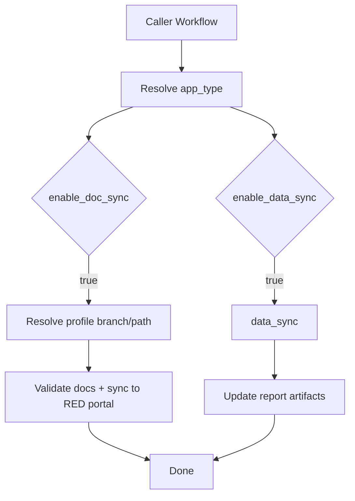

# Audi RED Toolkit Usage Guide

## Purpose

Use this reusable workflow to:

- Sync docs to RED Documentation Portal
- Optionally collect/report metadata (`data_sync`)
- Optionally enable VWGOA deployment (only for supported app types)

MSI and VWGOA behavior is profile-driven by `app_type`.

## Workflow Location

- Workflow: `.github/workflows/audired-tookit.yml`
- Profile config: `config/app-type-profiles.yml`

## Supported App Types

- Preferred input: `app_type`
  - `feature_app`
  - `backend_service`
  - `mobile_app`
  - `graph_service`
  - `special_app`
- Legacy input: `project_type` (deprecated)
  - `frontend-app` -> `feature_app`
  - `backend-service` -> `backend_service`
  - `mobile-app` -> `mobile_app`
  - `graph-service` -> `graph_service`
  - `special-app` -> `special_app`
  - `auto-detect` (deprecated fallback)

If app type does not map to a profile key, workflow fails fast.

Precedence:

- If `app_type` is provided, it is always used.
- `project_type` is used only when `app_type` is not provided.

## Branch and Path Resolution

Branch/path are selected from `config/app-type-profiles.yml` using resolved `app_type`.

- RED docs branch: `red_docs.branch`
- RED docs base path: `red_docs.base_path`
- App folder resolved by replacing `{app}` with repository app name

`destination_branch` is deprecated and ignored by runtime logic.

## Special App Rules

For `special-app`:

- RED docs sync is supported
- MSI config is not used
- VWGOA is disabled (workflow fails if requested)
- Default branch: `docs-sync/special-apps`

Optional path override input:

- `red_docs_portal_path_override`

Guardrails:

- Must start with `docs/`
- Must not contain `..`
- If `{app}` is missing, `/<app_name>` is appended automatically

## Independent Job Behavior

`data_sync` and `doc_sync` run independently.

- `enable_data_sync=true` runs `data_sync`
- `enable_doc_sync=true` runs `doc_sync`
- Both can run together
- One can run without the other

## Deprecated Inputs (Kept for Compatibility)

These inputs remain defined but are ignored by runtime logic:

- `destination_branch`
- `destination_branch_create`
- `msiParentPageIds`

## Minimal Example

```yaml
jobs:
  publish_docs:
    uses: RED-Internal-Development/audi-red-toolkit/.github/workflows/audired-tookit.yml@main
    with:
      source_file: docs
      app_type: feature_app
      enable_doc_sync: true
      enable_data_sync: true
      enable_vwgoa_prod_support_deployment: false
      user_email: ci-bot@example.com
      user_name: ci-bot
      user_actor: ci-bot
    secrets:
      DOC_SYNC_KEY: ${{ secrets.DOC_SYNC_KEY }}
```

## Special App Example

```yaml
jobs:
  publish_special_app_docs:
    uses: RED-Internal-Development/audi-red-toolkit/.github/workflows/audired-tookit.yml@main
    with:
      source_file: docs
      app_type: special_app
      red_docs_portal_path_override: docs/special_programs/{app}
      enable_doc_sync: true
      enable_data_sync: false
      enable_vwgoa_prod_support_deployment: false
      user_email: ci-bot@example.com
      user_name: ci-bot
      user_actor: ci-bot
    secrets:
      DOC_SYNC_KEY: ${{ secrets.DOC_SYNC_KEY }}
```

## Execution Flow



## Troubleshooting

- `Unsupported app_type/profile mapping`
  - Fix `app_type` value or add corresponding profile key in `config/app-type-profiles.yml`
- `Invalid red_docs_portal_path_override`
  - Ensure it starts with `docs/` and does not include `..`
- `VWGOA deployment is not supported for all app_type`
  - Check which profile has vwgoa configs set in `config/app-type-profiles.yml`
  - Set `enable_vwgoa_prod_support_deployment: false`
